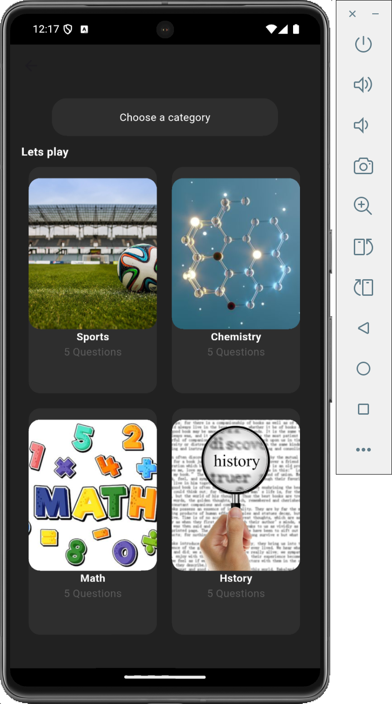
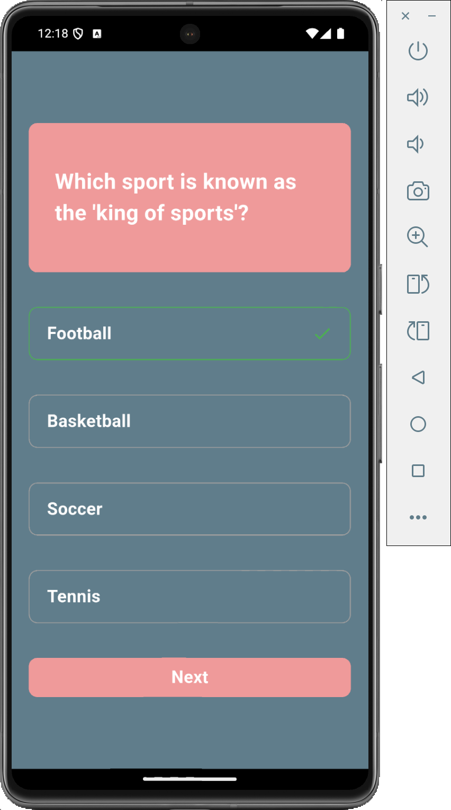
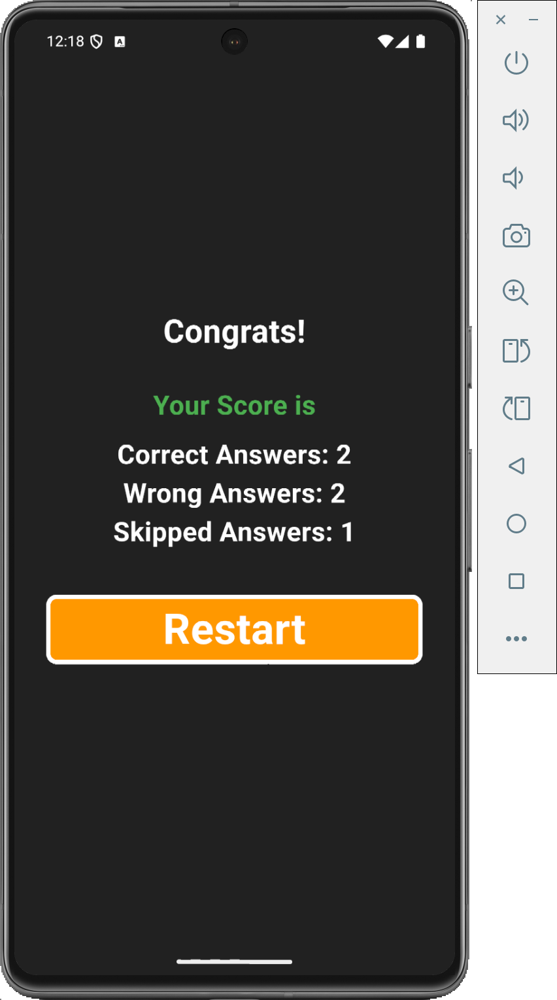

# quizapp
A fun and interactive quiz application built using Flutter. The app presents multiple-choice questions in various categories (like Math and Sports), keeps track of right, wrong, and skipped answers, and shows the final score on a results screen.A Quiz App in Flutter 

## Features

 Multiple quiz categories (e.g., Math, Sports, History, Chemistry)
 Tracks correct, wrong, and skipped answers
 Final score summary with clear UI
 Custom UI with color indicators for answer feedback

### Tech Stack

Flutter (UI framework)
Dart (Programming language)

#### Screenshots

